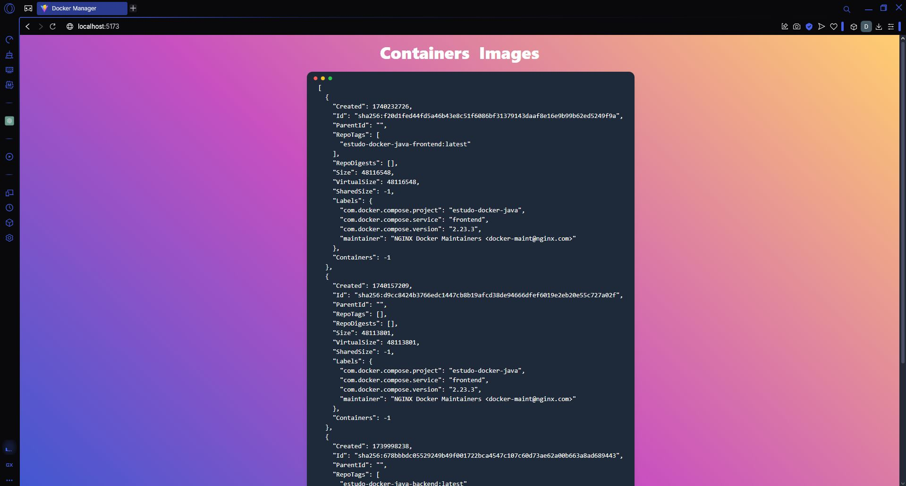

# Desafio Gerente de containers DOCKER🐋



> Este projeto foi feito acompanhando o video da Fernanda Kipper resolvendo um desafio Fullstack com Java Spring e Docker esse projedo foi construido com Java, o framework Spring Boot, Docker, Angular e TypeScript porem na minha versão para o front end utilizei React e TypeScript.

### Como clonar projeto

```
git clone https://github.com/danielBRTanimacao/estudo-docker-java.git

install dependencies on pom.xml

cd frontend
npm i
npm run dev
```

### 🟢 Como rodar projeto localmente?
Apos clonar a aplicação e baixar as dependencias `pom.xml` basta apenas rodar a raiz do projeto Spring no `src/main/java/com/daniel/docker_manager/DockerManagerApplication.java`.

Em um outro terminal você vai rodar o front end `cd ./frontend` utilize o comando `npm run dev` rode sua aplicação no navegador.

### Canais que utilizei para estudar 🐋

-   <a href="https://www.youtube.com/@kipperdev">Canal da Fernanda Kipper</a>
-   <a href="https://www.youtube.com/@GrandeFiasco">Canal do Fiasco</a>
